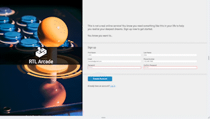

# Sign-Up-Form

https://jyfoil.github.io/sign-up-form/

## Project Description

This is a non-functioning Sign up form project that was built using HTML and CSS. The purpose of this project was to practice using newly learned HTML and intermediate CSS concepts including:

- HTML
  - Form structure
  - Form validation
- CSS

  - CSS properties (background-image)
  - CSS units (rem,em,%,px,vh,vw)
  - Advanced selectors
  - Positioning
  - Custom properties

### Responsiveness demonstration

## Reflection

I had more trouble then I initially thought with this project. I started it thinking it would be fairly simple because it was only using HTML and CSS. However, much of my struggles came with flexbox responsiveness and media queries. I was able to place things where I wanted them to be but when I resized the screen using devtools nothing was placed correctly.

Going from here I need to properly think about what is going under the hood with my CSS. Often I just speed through not really thinking about what my code is doing even if it works. I need to start thinking about "why" it works.

In hindsight, I could have made the three sections on the right of the image into flex items as well by displaying flex on the main tag. This would have solved the issue that I struggled on where text would overflow into the image for the mobile page. My way of solving it involved changing the font size when the viewport was smaller which is not the responsive way that I would have liked.

## Credits

[Arcade stick photo](https://unsplash.com/photos/i_qs6f6y8ag) by [Thomas Despeyroux
](https://unsplash.com/@thomasdes) on Unsplash
